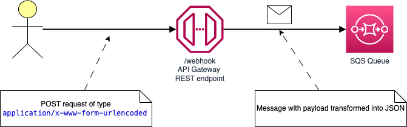

# universal-www-form-urlencoded
API Gateway REST endpoint that transforms `x-www-form-urlencoded` payload into `JSON` and sends to SQS queue as a message.




# Great success

@afronsky was able to fix the problem, and described the solution in his [pull request](pull/1). Please check out his explaination.

Thank you very much @afronsky for you help 🙏


## Working solution
The fix has been merged and can be tested by following those steps:

1. Make all BASH scripts executable `chmod +x *.sh`
1. Deploy solution using CloudFormation by executing `./cf-create-api.sh` script.
1. Send a test message to the endpoint using `./send-request.sh`.
1. View messages in the queue. Execute `./view-messages.sh` script.
1. The end (remove stack by executing `./cf-delete-api.sh` script.


# OUTDATED - Description of the problem with VTL

For future reference I left the **not working** copy of the configuration in a file name `cf-api-not-working.yaml`, as it may shed some light on how bizarre VTL is. 


## 1. API Gateway logging
If you don't have this enabled check out the [ApiGwLogginConfig](ApiGwLogginConfig) directory and deploy CloudFormation defined there.

## 2. Make shell files executable

There are several bash shell scripts (tested on MacOS). Make them executable:
```
chmod +x *.sh
```
### File descriptions

All files staring with `cf-` contain CloudFormation (AWS CLI) commands, that create, updated or delete the stack.
Also the `cf-update-api.sh` script is creating new `deployment` in API Gateway - after any change you need to redeploy it so this is automated.

There are also other helper scripts:
* `send-request.sh` - is sending sample test message to the API Gateway REST endpoint
* `view-messages.sh` - is checking for messages in the SQS queue
* `purge-messages.sh` - deletes all messages in the SQS queue

ℹ️ All scripts fetch unique values from CloudFormation stack, the `Outputs` section - so **you don't need to modify scripts** after you deploy this sample to your AWS Account.

## 3. Test the endpoint

First deploy the stack (scritps are using your default profile) by executing `./cf-create-api.sh` script.

I've prepared three configurations to present the problem fully. The First one is deployed by default and the rest is commented out in CloudFormation file.

### 3.1 Test run without VTL to prove that IAM is configured correctly

This configuration doesn't convert payload to JSON, but shows that Role is defined correctly and there is a communication between this API endpoint and SQS.
```YAML
application/x-www-form-urlencoded: |
  Action=SendMessage&MessageBody=$input.body
```
It is just passing it through. And it does it not well.


Let's send a test message to the endpoint using `send-request.sh`. Message is simple:

```
curl -X 'POST' ${ENDPOINT} \
  -H 'content-type: application/x-www-form-urlencoded' \
  -H 'user-agent: MyAgent' \
  -d $'type=test&foo=bar'
```
and its payload is `type=test&foo=bar`.

You should see success response (I have formatted it):
```
Sending sample data to API Gateway endpoint: https://6zda279as5.execute-api.us-east-1.amazonaws.com/dev/webhook
```
```XML
<?xml version="1.0"?>
<SendMessageResponse xmlns="http://queue.amazonaws.com/doc/2012-11-05/">
  <SendMessageResult>
    <MessageId>d6a3e1bc-cadc-4757-9317-dc0b421bd39d</MessageId>
    <MD5OfMessageBody>97a5c622f6dbe156849a71a233833a41</MD5OfMessageBody>
  </SendMessageResult>
  <ResponseMetadata>
    <RequestId>64c01a1e-11e0-5f9e-a9db-469c62911a82</RequestId>
  </ResponseMetadata>
</SendMessageResponse>
```

Now, let's see how the messages looks like in the queue. Execute `view-messages.sh` script.
```
Receive messages from SQS: https://sqs.us-east-1.amazonaws.com/052330230514/api-gw-to-sqs-SqsQueue-g1HMGFUKeeQk
```

```JSON
{
  "Messages": [
    {
      "MessageId": "d6a3e1bc-cadc-4757-9317-dc0b421bd39d",
      "ReceiptHandle": "AQEBFZjWUHOWDls3O8GZIEk1lulnkem8E/Is0vfD/1i9oEGHp/z8E+ZqrG9eRv9s3DnZAaLboXi/NqP5fbzGTC0JzZ6nlOPmbF8qiPVg925S/Qi94wSN3WIS5cftKdM4Z0u5pgkoM1mYdqzYieMR5bOeyc9UuZlr7Eh7P3WwCYapB04TbW3iov9i1R8xu54RCWBsB53t4vw/DNHd0gPXCdL0vgEn6rzG4hihAfFJWY0aAUPtibopPHwnoKYlGlXBLbxCkACBF87snxBSfSBbkjfxRq/M7X/KwYVUKw65TNrtJU9+cedyLhpyKzcKHKnw7kqS3zSASybxWIAJDDyly6FoKmgT481uY/Hn5i1kcf2vmDj1pNlN+0+O0Fgd51l6CMU/htpLBz/gHgjYAbn6zzgcp4+3O/55/EumMy4JY/AemlU=",
      "MD5OfBody": "97a5c622f6dbe156849a71a233833a41",
      "Body": "type=test", <-- WHERE IS THE REST OF PAYLOAD?
      "Attributes": {
        "SenderId": "AROAQYLY76LZPMZ5YTWD7:BackplaneAssumeRoleSession",
        "ApproximateFirstReceiveTimestamp": "1678275039587",
        "ApproximateReceiveCount": "1",
        "SentTimestamp": "1678274865151",
        "AWSTraceHeader": "Root=1-64087131-44df062d5a23bc565f59804d"
      }
    }
  ]
}
```

This is a known problem - we should encode payload using base64 but **WE WANT JSON** no base64 string.

Use `purge-messages.sh` to delete all messages.

### 3.2 The VTL

The VTL script used here is supposed to transform `www-form-urlencoded` payload into JSON and send it to the SQS as a message.

Go to the `cf-api.yaml` file, line 80.
1. Comment out CONFIGURATION 1
2. UNcomment CONFIGURATION 2 - from line 97 to 133

Now execute `cf-update-api.sh` and wait a moment.
```
./cf-update-api.sh 
Updating CloudFormation stack
{
    "StackId": "arn:aws:cloudformation:us-east-1:123412341234:stack/api-gw-to-sqs/d7596ee0-bd96-11ed-8605-0e7f9f45c4ad"
}
Waiting for update to complete
Update done
Re-deploying API Gateway to make sure changes are applied
{
    "id": "ccf831",
    "createdDate": "2023-03-08T12:39:14+01:00"
}
```


After CloudFormation is updated and API Gateway redeployed let's test it. 

⚠️ **Watch out**, my experience shows that several first requests are handled by the old configuration! That's strange, I don't know why is that?

Execute the same `send-request.sh`. This time we get an error:
```XML
<?xml version="1.0"?>
<ErrorResponse xmlns="http://queue.amazonaws.com/doc/2009-02-01/">
  <Error>
    <Type>Sender</Type>
    <Code>AccessDenied</Code>
    <Message>Access to the resource
      https://sqs.us-east-1.amazonaws.com/123412341234/api-gw-to-sqs-SqsQueue-g1HMGFUKeeQk is
      denied.</Message>
    <Detail />
  </Error>
  <RequestId>59114cd3-5acf-5063-985c-10512cb41dd8</RequestId>
</ErrorResponse>
```

And we get an `AccessDenied` error.

Only it's not problem with the access since we saw with CONFIGURATION 1 that IAM role is correct. 

This error message is simply misleading.

This is a known thing, API Gateway works like that :-(

Now, go to CloudWatch logs, and select LogGroup named `API-Gateway-Execution-Logs_<YOUR API ID>/dev`. 
Select last stream and check the logs:

```
(b11db56d-0b10-4755-9b7b-0b7e1d8599c4) Endpoint request body after transformations: 

   
    
Action=SendMessage&MessageBody=
{
    "type": "test",
    "foo": "bar"
}
```

In logs it looks like the VTL script is working correctly!


However, in next lines we see that it was rejected by SQS.
```
(b11db56d-0b10-4755-9b7b-0b7e1d8599c4) Sending request to https://sqs.us-east-1.amazonaws.com/123412341234/api-gw-to-sqs-SqsQueue-g1HMGFUKeeQk
(b11db56d-0b10-4755-9b7b-0b7e1d8599c4) Received response. Status: 403, Integration latency: 2 ms
```
`403` - forbidden

### 3.3 Static JSON instead of VTL

And now it gets interesting!

1. Go to the `cf-api.yaml` file  and uncomment CONFIGURATION 3.
1. Now execute `cf-update-api.sh` and wait a moment.
1. After it's done send the test request again. Usually several first responses are executed by the cached old configuration. (It's interesting on it's own why that happens?)
1. And here is the response of the `send-request.sh`.


```XML
<?xml version="1.0"?>
<SendMessageResponse xmlns="http://queue.amazonaws.com/doc/2012-11-05/">
  <SendMessageResult>
    <MessageId>5bb31de4-c9fd-4223-8f8b-274b197cd2a6</MessageId>
    <MD5OfMessageBody>a1ee08a59db8e9422fac146d5127f925</MD5OfMessageBody>
  </SendMessageResult>
  <ResponseMetadata>
    <RequestId>115236cc-50fe-5625-b4e4-6a4e2a28af05</RequestId>
  </ResponseMetadata>
</SendMessageResponse>
```

It's a success. 

And there is a message in the queue, execute `view-messages.sh`:

```JSON
{
  "Messages": [
    {
      "MessageId": "cb3d1b88-4661-4923-9044-5e37fd0e0c47",
      "ReceiptHandle": "AQEBf6MB4vX4nk78PDwAYYvXFgwGiWz4HX7SWxoCAUk4Y7V9CRJYhIoAIt2p9vKUcMRuvqP4epCcecJbuBA6qI9vvvqtyRaQwhxwBq6LUhTztnYjNAeKDPUUWyPeNx0FbtfqcBPmLr7OoWxTY2lG923Aga0BoizH/d79gkB1zMalD3lI98MTnO2qcfwsSwi9uPUv2ziE+QtZNFaPcDjkzVVkUw9L3QMNljUxZ9AJ8gQiNMo+2lLbjrkr+soou+QibAONaWks9d17PhnbPpmeTkhIViD0eAQwacCQEzIRmJyO20y1qxrGsTiGMZWC6F0ViErA0bmCr7go2VDv0ntXKOwf3t2kbROyd5fDAN3HJxYRobk3Os+ZSS8uzHbBtmhs74Rv3lZTw2i1g8zMkZJAK2Inm76qLIkUZnv2DeSnRGB21ZE=",
      "MD5OfBody": "a1ee08a59db8e9422fac146d5127f925",
      "Body": "{\n    \"type\": \"test\",\n    \"foo\": \"bar\"\n}",  <-- this is stringified JSON
      "Attributes": {
        "SenderId": "AROAQYLY76LZPMZ5YTWD7:BackplaneAssumeRoleSession",
        "ApproximateFirstReceiveTimestamp": "1678276780979",
        "ApproximateReceiveCount": "1",
        "SentTimestamp": "1678276735832",
        "AWSTraceHeader": "Root=1-6408787f-3f57ecf94de24af309354198"
      }
    }
  ]
}
```